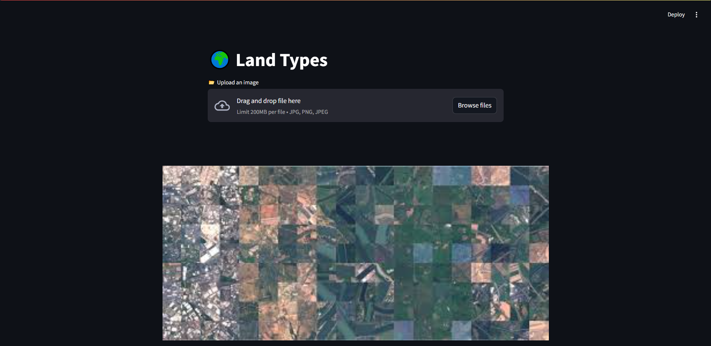
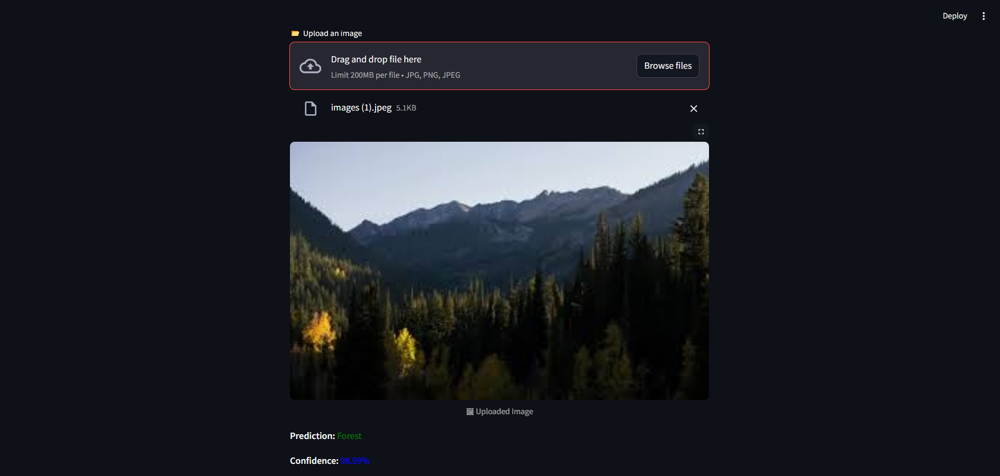

Land Type Classification

📌 Project Overview

## 🌐 API Screenshot
Here is a preview of the **Flask API** in action:

   

This project focuses on Land Type Classification using deep learning techniques. The goal is to accurately classify different land types based on satellite or aerial imagery. The model is trained on an image dataset and leverages machine learning techniques to predict the type of land, such as forests, water bodies, urban areas, and agricultural land.

🚀 Features

Streamlit Web App for an interactive interface

Flask API to handle image classification requests

Pretrained ResNet-50 Model for land type classification

Image Upload Support for real-time classification

Confidence Score Display for predictions

 PyTorch for deep learning

ResNet-50 for image classification

OpenCV & PIL for image processing

Streamlit for UI development

Flask for API deployment

Matplotlib & Seaborn for data visualization

📊 Model Details

The model is based on ResNet-50 and trained on satellite images.

Modified ResNet-50 with a custom fully connected layer.

Achieved an accuracy of XX% on the test dataset.

Evaluation metrics include:

Accuracy

Precision & Recall

Confusion Matrix
